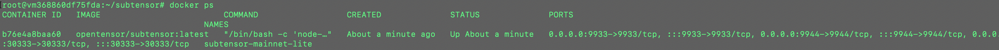
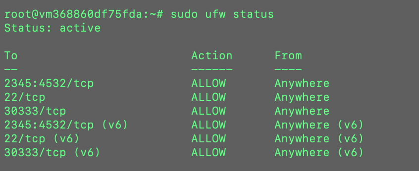
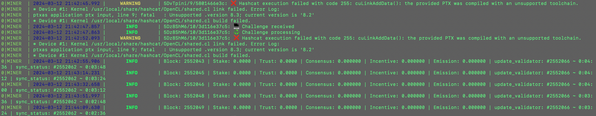

### Original Guide (Neural Internet's):

[Miner Setup Guide for SN 27](https://docs.neuralinternet.ai/products/subnet-27-compute/bittensor-compute-subnet-miner-setup)

## Updated Guide with Useful Extra Steps:

* Find a cloud GPU provider and deploy an instance of a machine.
* SSH into it

### Install Docker:
 * In root directory install docker using following commands:

 ###### Add Docker's official GPG key:

 `sudo apt-get update`
 
 `sudo apt-get install ca-certificates curl`
 
 `sudo install -m 0755 -d /etc/apt/keyrings`
 
 `sudo curl -fsSL https://download.docker.com/linux/ubuntu/gpg -o /etc/apt/keyrings/docker.asc`
 
 `sudo chmod a+r /etc/apt/keyrings/docker.asc`
 
 ######  Add the repository to Apt sources:

 
 `echo \
  "deb [arch=$(dpkg --print-architecture) signed-by=/etc/apt/keyrings/docker.asc] https://download.docker.com/linux/ubuntu \
  $(. /etc/os-release && echo "$VERSION_CODENAME") stable" | \
  sudo tee /etc/apt/sources.list.d/docker.list > /dev/null`

 `sudo apt-get update`
 
 ###### Install the Docker packages:
 
 ` sudo apt-get install docker-ce docker-ce-cli containerd.io docker-buildx-plugin docker-compose-plugin`
 
 ###### Verify that the Docker Engine installation is successful by running the hello-world image:
 
 ` sudo docker run hello-world`

### Install Subtensor locally:

* in root directory:

`git clone https://github.com/opentensor/subtensor.git`

`sudo ufw allow 30333/tcp`

`cd subtensor`

###### runs a lite node on the mainet

`sudo ./scripts/run/subtensor.sh -e docker --network mainnet --node-type lite`

###### Run Docker to see if it is running for Subtensor with:

`docker ps`

* `cd` back to root directory

### Install BitTensor:

* in root directory:

`/bin/bash -c "$(curl -fsSL https://raw.githubusercontent.com/opentensor/bittensor/master/scripts/install.sh)"`

###### verify the installation was successful by running:

`btcli --help`

##### Create a coldkey/hotkey pair or regenerate it from an existing keypair:

###### Create a new keypair:

`btcli w new_coldkey`

`btcli w new_hotkey`

or

###### Regen the keys if already existing:

`btcli w regen_coldkey --mnemonic <words>`

`btcli w regen_hotkey --mnemonic <words>`

### Install Subnet 27 Compute-Subnet:

`git clone https://github.com/neuralinternet/Compute-Subnet.git`

`cd Compute-Subnet`

`python3 -m pip install -r requirements.txt`

`python3 -m pip install -e .`

##### Install extra dependencies for miners

* in Compute-Subnet folder:

###### In case of missing requirements:

`sudo apt -y install ocl-icd-libopencl1 pocl-opencl-icd`

###### Install Hashcat:

* in Compute-Subnet folder:

* Recommended hashcat version >= v6.2.5

`wget https://hashcat.net/files/hashcat-6.2.6.tar.gz`

`tar xzvf hashcat-6.2.6.tar.gz`

`cd hashcat-6.2.6/`

`sudo make`

`sudo make install`

`export PATH=$PATH:/usr/local/bin/`

`echo "export PATH=$PATH">>~/.bashrc`

###### Check version is v6.2.6

`hashcat --version`

`cd` back to root directory

### Install NVIDIA CUDA Toolkit & Drivers

* in root directory:

`sudo apt install build-essential`

`sudo apt install software-properties-common`

`sudo add-apt-repository ppa:ubuntu-toolchain-r/test`

`sudo apt update`

`sudo apt upgrade`

`sudo apt install gcc-12 g++-12 gcc-13 g++-13 -y`

`sudo update-alternatives --install /usr/bin/gcc gcc /usr/bin/gcc-12 12 --slave /usr/bin/g++ g++ /usr/bin/g++-12`

`sudo update-alternatives --install /usr/bin/gcc gcc /usr/bin/gcc-13 13 --slave /usr/bin/g++ g++ /usr/bin/g++-13`

`sudo update-alternatives --config gcc`

`wget https://developer.download.nvidia.com/compute/cuda/repos/ubuntu2204/x86_64/cuda-ubuntu2204.pin`

`sudo mv cuda-ubuntu2204.pin /etc/apt/preferences.d/cuda-repository-pin-600`

`wget https://developer.download.nvidia.com/compute/cuda/12.3.1/local_installers/cuda-repo-ubuntu2204-12-3-local_12.3.1-545.23.08-1_amd64.deb`

`sudo dpkg -i cuda-repo-ubuntu2204-12-3-local_12.3.1-545.23.08-1_amd64.deb`

`sudo cp /var/cuda-repo-ubuntu2204-12-3-local/cuda-*-keyring.gpg /usr/share/keyrings/`

`sudo apt-get update`

`sudo apt-get -y install cuda-toolkit-12-3`

`sudo apt-get install -y nvidia-kernel-open-545`

`sudo apt-get install -y cuda-drivers-545`

`export CUDA_VERSION=cuda-12.3`

`export PATH=$PATH:/usr/local/$CUDA_VERSION/bin`

`export LD_LIBRARY_PATH=/usr/local/$CUDA_VERSION/lib64`

`echo "">>~/.bashrc`

`echo "PATH=$PATH">>~/.bashrc`

`echo "LD_LIBRARY_PATH=$LD_LIBRARY_PATH">>~/.bashrc`

`sudo reboot`

###### Check if install went successfully:

`nvidia-smi`

`nvcc --version`

* cuda versions should match across above two commands

### Install PM2

* in root directory:

`sudo apt update`

`sudo apt install npm`

`sudo npm install pm2 -g`

###### Check if PM2 is installed correctly:

`pm2 ls`

### Start Docker service in Compute-Subnet:

`cd Compute-Subnet`

`sudo systemctl start docker`

`sudo apt install at`

###### Check if docker running correctly:

`sudo service docker status`

###### example of correctly running:

`root@merciful-bored-zephyr-fin-01:~# sudo service docker status
● docker.service - Docker Application Container Engine
     Loaded: loaded (/lib/systemd/system/docker.service; enabled; vendor preset>
     Active: active (running)`

### Setting up firewall for miner:

*in Compute-Subnet folder

`sudo apt update`

`sudo apt install ufw`

###### Open ports on firewall:

`sudo ufw allow xxxx:yyyy/tcp`

(can be any ports for above but I use 2345:4532)

`sudo ufw allow 22/tcp`

`sudo ufw enable`

###### Check if firewall has opened the correct ports:

`sudo ufw status`

### Register miner to subnet:

*can be in root or Computer-Subnet folder:

`btcli s register --subtensor.network finney --netuid 27`

### Start Miner script:

`cd Compute-Subnet`

`pm2 start ./neurons/miner.py --name MINER --interpreter python3 -- --netuid 27 --subtensor.network local --wallet.name COLDKEYNAME --wallet.hotkey HOTKEYNAME --axon.port 2345 --logging.debug --miner.blacklist.force_validator_permit --auto_update yes`

### Check Miner is running with PM2:

* in any folder run:

`pm2 logs`

or 

`pm2 monit`

## Extra steps following on from subnet27 guide (already included in above full guide)

### SubTensor Install Extra Steps:

`rm -rf subtensor/`

`git clone https://github.com/opentensor/subtensor.git`

`sudo ufw allow 30333/tcp`

`cd subtensor/`

`sudo ./scripts/run/subtensor.sh -e docker --network mainnet --node-type lite`

Confirm the local subtensor is working with:

`btcli s list --subtensor.chain_endpoint ws://127.0.0.1:9944`

Run Docker to see if it is running for Subtensor with:

`docker ps`

### NVDIA CUDA Drivers install extra steps

`sudo apt install build-essential`

`sudo apt install software-properties-common`

`sudo add-apt-repository ppa:ubuntu-toolchain-r/test`

`sudo apt update`

`sudo apt upgrade`

`sudo apt install gcc-12 g++-12 gcc-13 g++-13 -y`

`sudo update-alternatives --install /usr/bin/gcc gcc /usr/bin/gcc-12 12 --slave /usr/bin/g++ g++ /usr/bin/g++-12`

`sudo update-alternatives --install /usr/bin/gcc gcc /usr/bin/gcc-13 13 --slave /usr/bin/g++ g++ /usr/bin/g++-13`

`sudo update-alternatives --config gcc`

`wget https://developer.download.nvidia.com/compute/cuda/repos/ubuntu2204/x86_64/cuda-ubuntu2204.pin`

`sudo mv cuda-ubuntu2204.pin /etc/apt/preferences.d/cuda-repository-pin-600`

`wget https://developer.download.nvidia.com/compute/cuda/12.3.1/local_installers/cuda-repo-ubuntu2204-12-3-local_12.3.1-545.23.08-1_amd64.deb`

`sudo dpkg -i cuda-repo-ubuntu2204-12-3-local_12.3.1-545.23.08-1_amd64.deb`

`sudo cp /var/cuda-repo-ubuntu2204-12-3-local/cuda-*-keyring.gpg /usr/share/keyrings/`

`sudo apt-get update`

`sudo apt-get -y install cuda-toolkit-12-3`

`sudo apt-get install -y nvidia-kernel-open-545`

`sudo apt-get install -y cuda-drivers-545`

I am not sure if 545 will work or if the new version if 550, this worked for me when I was mining

The above steps should remove the hashcat error when trying to get the miner to run and checking logs using `pm2 logs`:

### Extra Steps:

##### Confirm the local subtensor is working with:

* in subtensor folder run:

`btcli s list --subtensor.chain_endpoint ws://127.0.0.1:9944`

##### To check if miner is getting rewards:

`btcli w overview --wallet.name $cold --subtensor.network finney`

Replacing the $cold with the coldkey

##### To check what ports are open use:

`sudo ufw status`

Ports which were specified during install (2345:4532) and port 30333 should be open. 

##### To check miner hash speed:

`hashcat -b -m 610`

##### To SSH into remote machine:

`ssh <user>@<ip_address> -i ~/.ssh/id_ed25519`

##### To regenerate coldkey/hotkey:

to recreate coldkey if it gets lost/want to use on another miner:

`btcli w regen_coldkey --mnemonic <words>`

to recreate hotkey:

`btcli w regen_hotkey --mnemonic <words>`

### Other Comments:

* it is best currently to run only one gpu per hotkey
* try to avoid removing staked TAO whilst miner is still running. if it is to be done, then make sure you don't leave a zero staked balance (i.e don't unstake it all)
* You can register the same hotkey on multiple subnets

